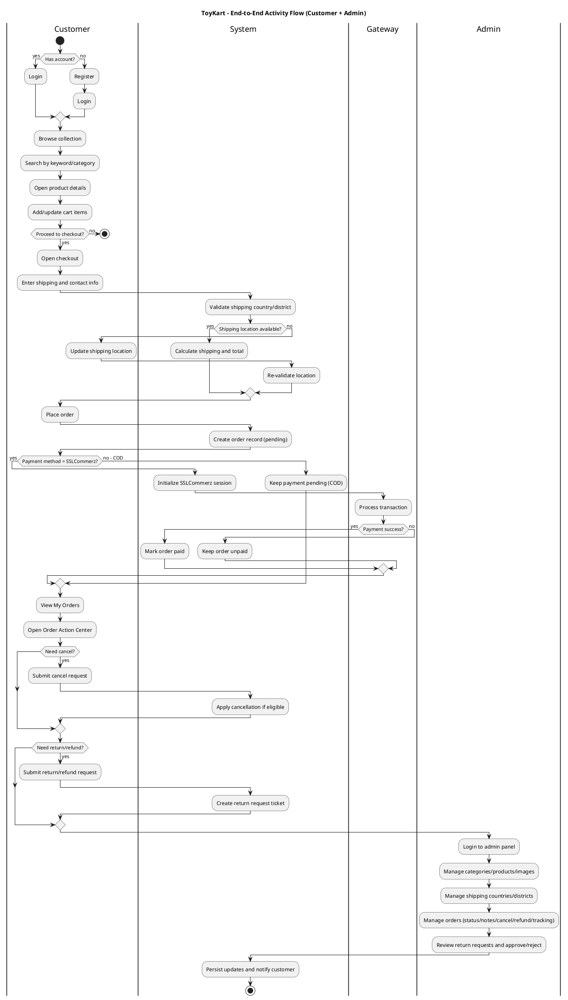

# ToyKart Activity Diagram (Revised)

This version is aligned with the current codebase and removes unsupported wording like advanced user-side product filtering controls.

## Main Activities (15, Step-by-Step)

1. Register account or login (Customer)
2. Browse product collection (Customer)
3. Search products by keyword or category route (Customer)
4. View product details (Customer)
5. Add/update/remove cart items (Customer)
6. Proceed to checkout (Customer)
7. Enter shipping details and select available district/city (Customer)
8. Review totals and place order (Customer)
9. Complete payment (SSLCommerz) or keep COD pending (Customer/System/Gateway)
10. View my orders and order action center (Customer)
11. Cancel order or request return/refund (Customer)
12. Login to admin panel (Admin)
13. Manage catalog and shipping data (categories, products, image upload, shipping countries/districts) (Admin)
14. Manage customer orders (status, notes, cancel, refund, tracking fields) (Admin)
15. Review and decide return requests (approve/reject/update status) (Admin)

## PlantUML Code

