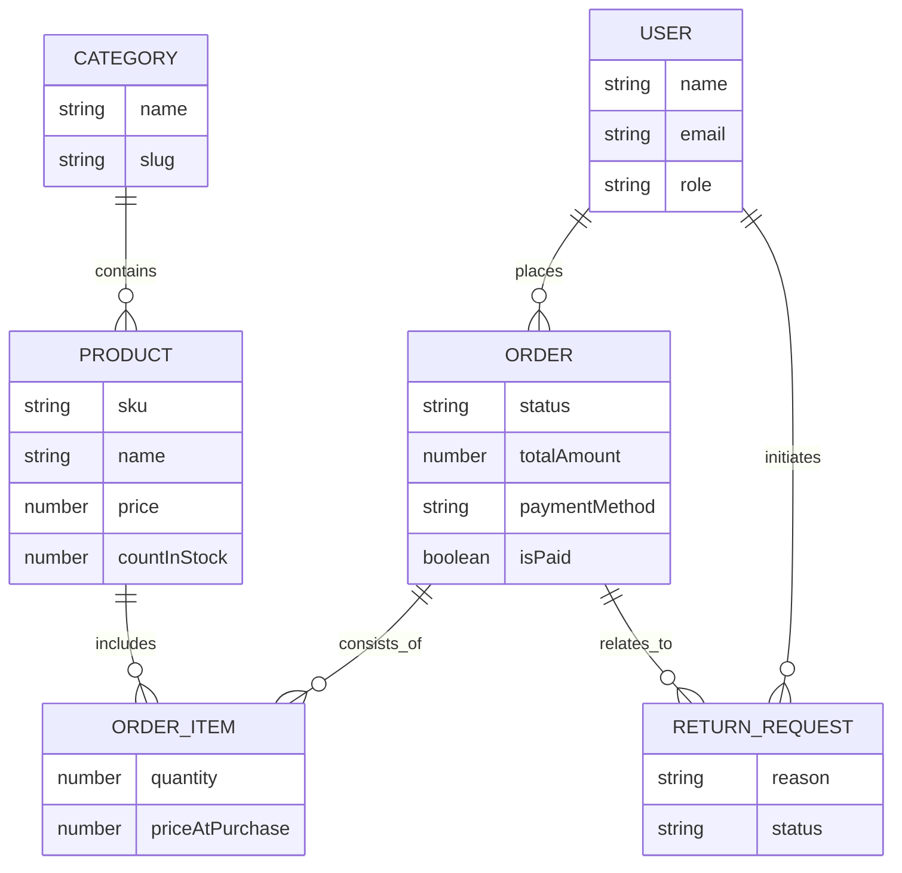
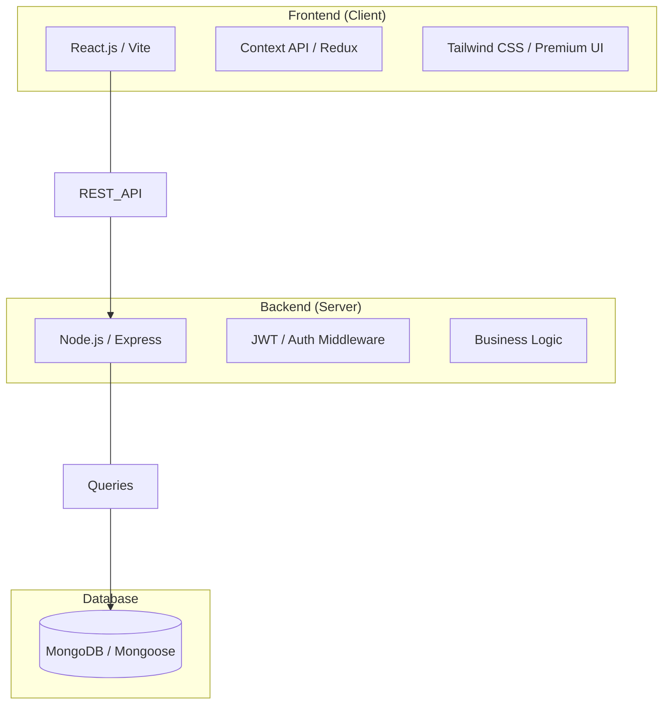

# ToyKart System Diagrams

This document provides a visual overview of the ToyKart e-commerce platform's architecture, data models, and functional requirements.

## 1. Use Case Diagram
The Use Case Diagram defines the interactions between different types of users (Actors) and the system's core features.

PlantUML source (for a UML-tool style diagram closer to your uploaded sample): `docs/use_case_diagram.puml`

```mermaid
usecaseDiagram
    actor "Visitor" as Visitor
    actor "Customer" as Customer
    actor "Admin" as Admin
    actor "SSLCommerz" as Gateway

    rectangle "ToyKart System" {
        usecase "Browse Products" as UC_BROWSE
        usecase "Search Products" as UC_SEARCH
        usecase "View Product Details" as UC_VIEW_PRODUCT
        usecase "View Shipping Locations" as UC_SHIPPING_LOC
        usecase "Register Account" as UC_REGISTER
        usecase "Login" as UC_LOGIN
        usecase "Manage Cart" as UC_CART
        usecase "Checkout" as UC_CHECKOUT
        usecase "Place Order" as UC_PLACE_ORDER
        usecase "Pay via SSLCommerz" as UC_PAY_SSL
        usecase "View My Orders" as UC_MY_ORDERS
        usecase "View Order Details" as UC_ORDER_DETAILS
        usecase "Cancel My Order" as UC_CANCEL_ORDER
        usecase "Delete Order History" as UC_DELETE_HISTORY
        usecase "Create Return Request" as UC_RETURN_CREATE
        usecase "View My Return Requests" as UC_RETURN_VIEW

        usecase "Admin Login" as UC_ADMIN_LOGIN
        usecase "Manage Products" as UC_ADMIN_PRODUCTS
        usecase "Upload Product Image" as UC_ADMIN_UPLOAD
        usecase "Manage Categories" as UC_ADMIN_CATEGORIES
        usecase "Manage Shipping Countries" as UC_ADMIN_COUNTRIES
        usecase "Manage Shipping Districts" as UC_ADMIN_DISTRICTS
        usecase "Manage Orders\n(list/update/status/note/cancel/refund)" as UC_ADMIN_ORDERS
        usecase "Manage Return Requests" as UC_ADMIN_RETURNS
        usecase "View Customers" as UC_ADMIN_USERS
    }

    Visitor --> UC_BROWSE
    Visitor --> UC_SEARCH
    Visitor --> UC_VIEW_PRODUCT
    Visitor --> UC_SHIPPING_LOC
    Visitor --> UC_REGISTER
    Visitor --> UC_LOGIN
    Visitor --> UC_CART

    Customer --|> Visitor
    Customer --> UC_CHECKOUT
    Customer --> UC_PLACE_ORDER
    Customer --> UC_MY_ORDERS
    Customer --> UC_ORDER_DETAILS
    Customer --> UC_CANCEL_ORDER
    Customer --> UC_DELETE_HISTORY
    Customer --> UC_RETURN_CREATE
    Customer --> UC_RETURN_VIEW

    Admin --> UC_ADMIN_LOGIN
    Admin --> UC_ADMIN_PRODUCTS
    Admin --> UC_ADMIN_UPLOAD
    Admin --> UC_ADMIN_CATEGORIES
    Admin --> UC_ADMIN_COUNTRIES
    Admin --> UC_ADMIN_DISTRICTS
    Admin --> UC_ADMIN_ORDERS
    Admin --> UC_ADMIN_RETURNS
    Admin --> UC_ADMIN_USERS

    UC_SEARCH ..> UC_BROWSE : <<extend>>
    UC_CHECKOUT ..> UC_LOGIN : <<include>>
    UC_PLACE_ORDER ..> UC_CHECKOUT : <<include>>
    UC_PAY_SSL ..> UC_PLACE_ORDER : <<extend>>
    Gateway --> UC_PAY_SSL
    UC_CANCEL_ORDER ..> UC_ORDER_DETAILS : <<include>>
    UC_RETURN_CREATE ..> UC_ORDER_DETAILS : <<include>>
    UC_DELETE_HISTORY ..> UC_MY_ORDERS : <<include>>
    UC_ADMIN_UPLOAD ..> UC_ADMIN_PRODUCTS : <<include>>
```

---

## 2. Entity Relationship Diagram (ERD)
The ERD shows the core database entities and their relationships within the MongoDB database.



---

## 3. High-Level Architecture
ToyKart follows the **MERN** stack architecture (MongoDB, Express, React, Node.js).


